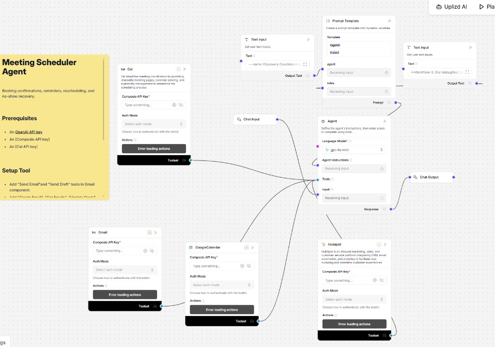

# Meeting Scheduler Agent

> Open-source web UI for the **Meeting Scheduler Agent** — powered by [UPLIZD](https://uplizd.ai). The hosted flow handles booking confirmations, reminders, rescheduling, and no-show recovery using **gpt-4o-mini**, a composable instruction block (`{agent}` + `{rules}`), and Composio-backed tools for **Cal.com**, **Gmail**, **Google Calendar**, and **HubSpot**.

[](https://uplizd.ai/marketplace/meeting-scheduler-agent)



---

## How it works

This repo is **only the playground UI + Express proxy**. Integrations run inside your **UPLIZD** flow after Marketplace install—you attach OpenAI, Composio, Cal.com, Gmail, Google Calendar, and HubSpot **in-studio**, not in `.env`.

```
Browser  →  React UI  →  POST /api/run (proxy)  →  UPLIZD API  →  Meeting Scheduler flow
```

---

## Workflow logic (matches the Langflow canvas)

| Piece | Role |
|-------|------|
| **Chat Input** | User asks to book, remind, reschedule, follow up |
| **Prompt template** | Concatenates `{agent}` + `{rules}` from two **Text Input** nodes into **Agent Instructions** |
| **Language Model** | `gpt-4o-mini` |
| **Cal.com** (Composio) | Booking links, availability, scheduling surface |
| **Gmail** (Composio) | Send email, send draft (per your enabled actions) |
| **Google Calendar** (Composio) | Create event, get events, update event |
| **HubSpot** (Composio) | CRM contact/deal context during scheduling |
| **Chat Output** | Confirmation text back to the user |

**Prerequisites (configured in the flow):** OpenAI API key, Composio API key, Cal.com API key, plus OAuth / auth for Gmail, Google Calendar, and HubSpot through Composio.

---

## Features

- Chat playground aligned with the flow’s **Chat Input / Chat Output**
- **Secure proxy** — `UPLIZD_API_KEY` never reaches the browser
- **Quick prompts** for typical scheduling operations
- **Dark mode** — follows system preference
- **Session ID** — “New session” rotates `session_id` for the run API

---

## Extension ideas

Enhancements that preserve **browser → proxy → UPLIZD** and Composio-backed tools in the flow:

- **Playbooks in `{rules}`** — e.g. “new inbound demo,” “customer renewal,” “no-show recovery” with fixed steps (Calendar → Gmail → HubSpot note).
- **Timezone & buffers** — Text Input rules that state working hours, minimum notice, and meeting length so the model avoids invalid slots across Cal.com + Google Calendar.
- **CRM-first routing** — HubSpot-enriched instructions: owner rotation, account tier, or “exec vs. AE” meeting types without altering this repo’s API surface.
- **Audit trail** — Flow-side pattern to log confirmations (which tool wrote what) in Chat Output for support handoff.

---

## Stack

| Layer | Tech |
|-------|------|
| Frontend | React 18 + Vite |
| Proxy | Express (Node.js) |
| Workflow | UPLIZD Marketplace |

---

## Prerequisites

- Node.js ≥ 18
- UPLIZD account + API key
- Flow installed from Marketplace when published (or import the template in your workspace)

---

## Quick start

### 1 — Install the flow

**[→ Meeting Scheduler Agent on UPLIZD Marketplace](https://uplizd.ai/marketplace/meeting-scheduler-agent)**

1. Install the flow and open it in the editor.
2. Copy **Flow ID** from the URL.
3. **Settings → API Keys** — create or copy your UPLIZD key.
4. In the flow: set **OpenAI** on the model node; set **Composio** + **Cal.com** on the tool nodes; complete Composio auth for **Gmail**, **Google Calendar**, and **HubSpot**.

### 2 — Configure this repo

```bash
git clone https://github.com/uplizd/meeting-scheduler-agent.git
cd meeting-scheduler-agent
cp .env.example .env
```

```bash
UPLIZD_API_KEY=your_api_key_here
UPLIZD_FLOW_ID=your_flow_id_here
```

### 3 — Run locally

```bash
npm run install:all
npm run dev
```

Open **http://localhost:5173**

---

## Environment variables

| Variable | Required | Description |
|----------|----------|-------------|
| `UPLIZD_API_KEY` | ✅ | Your UPLIZD API key |
| `UPLIZD_FLOW_ID` | ✅ | Flow ID after install |
| `UPLIZD_BASE_URL` | — | Default `https://studio.uplizd.ai` |
| `PORT` | — | Proxy (default `3001`) |
| `CORS_ORIGIN` | — | Default `http://localhost:5173` |
| `FLOW_INPUT_TYPE` / `FLOW_OUTPUT_TYPE` | — | Default `chat` |

---

## Project structure

```
meeting-scheduler-agent/
├── .env.example
├── package.json
├── server/index.js       # Proxy to UPLIZD /api/v1/run/:flowId
├── web/                  # Vite + React
└── docs/
    ├── workflow.png
    ├── setup.md
    └── contributing.md
```

---

## Contributing

See [docs/contributing.md](docs/contributing.md).

---

## License

MIT — see [LICENSE](LICENSE).
